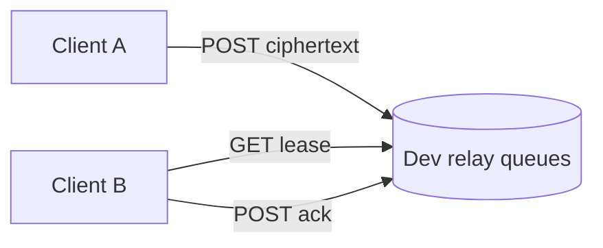
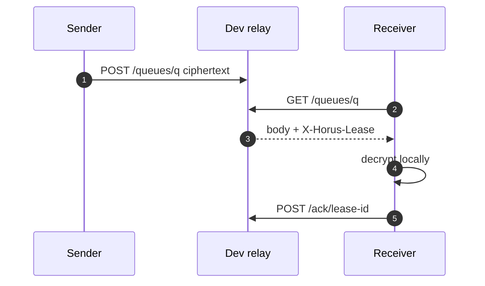

# horus-dev-relay

Local/development **HTTP mailbox** for Horus protocol tests and lab clients.

It stores **opaque encrypted blobs** only (lease + ACK, TTL). It can also host an **in-memory** username registry for local `@` claim experiments.

> **Not** a production anonymity network. Real deployments use **Tor onion mailboxes** inside [horus-protocol](https://github.com/horus-chat/horus-protocol). This relay exists so you can develop without Tor.

| | Links |
|---|--------|
| Protocol | [horus-protocol](https://github.com/horus-chat/horus-protocol) |
| Docs hub | [relay.md](https://github.com/horus-chat/horus/blob/main/docs/relay.md) |
| Registry crate (sibling) | [horus-username-registry](https://github.com/horus-chat/horus-username-registry) |
| Threat model | [security-threat-model.md](https://github.com/horus-chat/horus/blob/main/docs/security-threat-model.md) |

**License:** MIT · **Audit:** not independently audited

---

## Why it exists

| Job | Dev relay | Production Tor path |
|-----|-----------|---------------------|
| Move ciphertext between two lab clients | Yes (HTTP on localhost/LAN) | Onion mailbox over Tor |
| Hide client IP from a Horus operator | **No** — you are the operator | Tor circuits |
| Store plaintext | **Never** | **Never** |
| Lease + ACK so polls are not delete-on-read | Yes | Mailbox semantics on device |



---

## Quick start

Path dependency: clone the registry repo as a **sibling**.

```bash
mkdir horus-workspace && cd horus-workspace
git clone https://github.com/horus-chat/horus-username-registry.git
git clone https://github.com/horus-chat/horus-dev-relay.git
cd horus-dev-relay
cargo test
cargo run
# default: http://127.0.0.1:8787
```

Point a client config at:

```json
{
  "transport": "http",
  "relays": ["http://127.0.0.1:8787"]
}
```

On a physical phone, replace `127.0.0.1` with your machine’s LAN IP.

---

## Delivery model (lease + ACK)

1. `POST /queues/<id>` stores an opaque body with a TTL (default **7 days**, `HORUS_RELAY_TTL_SECS`).  
2. `GET /queues/<id>` **leases** the oldest message and returns header `X-Horus-Lease: <lease-id>`.  
3. Client must `POST /ack/<lease-id>` after receiving it.  
4. Unacked leases **redeliver** after ~5 minutes so a crashed client does not lose mail forever.



This matches how [horus-protocol](https://github.com/horus-chat/horus-protocol) HTTP/Waku clients expect to behave in lab mode.

---

## HTTP API

Full notes: [docs/api.md](docs/api.md)

```text
GET  /health

POST /queues/<queue-id>              # body = raw ciphertext bytes
GET  /queues/<queue-id>              # lease oldest; X-Horus-Lease
POST /ack/<lease-id>                 # drop leased message

POST /waku/v1/queues/<queue-id>      # hybrid bridge shapes
GET  /waku/v1/queues/<queue-id>
POST /waku/v1/ack/<lease-id>

# In-memory registry (lab @ claims) — see username-registry design
PUT  /registry/<username>
GET  /registry/<username>
```

Invites carry **send** and **recv** queue names; after accept, directions reverse (creator posts to send queue; joiner polls it). See [protocol docs](https://github.com/horus-chat/horus/blob/main/docs/protocol.md).

---

## Configuration

| Variable | Meaning | Default |
|----------|---------|---------|
| `HORUS_RELAY_TTL_SECS` | Message TTL | `604800` (7d) |
| `HORUS_RELAY_STATE` | Optional JSON persist path | unset (memory only) |
| Bind address | From binary / deploy scripts | `127.0.0.1:8787` |

Optional systemd unit sketches may live under [`deploy/`](deploy/).

---

## Security notes

- Traffic to this process is **not** anonymized. Use only on localhost or a trusted lab network.  
- Do not log request bodies in front proxies.  
- Registry endpoints are for **local experiments**; production `@` uses ICP ([horus-username-registry](https://github.com/horus-chat/horus-username-registry)).  
- Static “dev relay” crypto helpers exist for onion-forward demos — they are **not** a Tor substitute.

Report issues: [SECURITY.md](SECURITY.md).

---

## Related

| Repo | Role |
|------|------|
| [horus-protocol](https://github.com/horus-chat/horus-protocol) | Client that speaks this API in `http` / hybrid modes |
| [horus](https://github.com/horus-chat/horus) | Architecture & transport docs |
| [horus-wake-relay](https://github.com/horus-chat/horus-wake-relay) | Production wake pings (separate concern) |

## License

MIT — [LICENSE](LICENSE).
