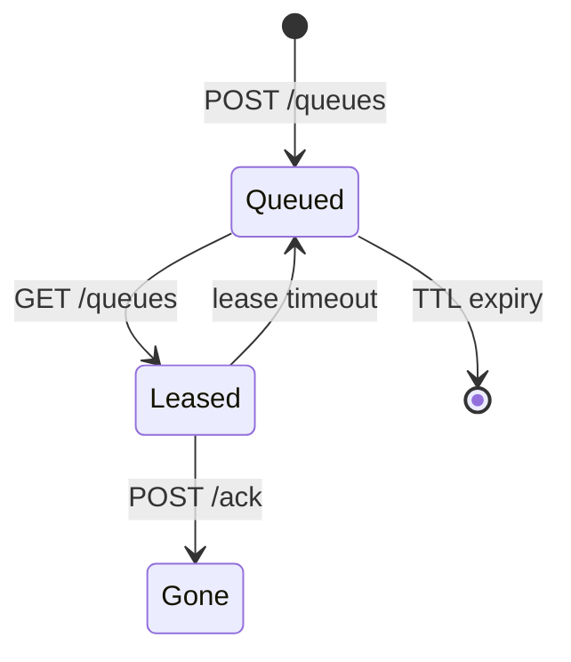

# Dev relay HTTP API

Companion to the crate [README](../README.md). Bodies on queue endpoints are **opaque ciphertext** — the relay must not parse them as chat.

## Health

```http
GET /health
```

Returns a small OK body when the process is up.

## Queues

### Store

```http
POST /queues/<queue-id>
Content-Type: application/octet-stream

<raw ciphertext bytes>
```

Creates / appends to an in-memory (or persisted) FIFO for `queue-id`. Queue names come from invite JSON (`send_queue` / `recv_queue`).

### Lease (poll)

```http
GET /queues/<queue-id>
```

- **200** — body is ciphertext; response includes `X-Horus-Lease: <id>`  
- **204 / empty** — nothing available (exact status depends on implementation path)

The message stays leased until ACK or lease timeout (~5 minutes), then becomes eligible again.

### ACK

```http
POST /ack/<lease-id>
```

Drops the leased message permanently.



## Waku-shaped paths

For hybrid transport spikes the same semantics appear under:

```text
POST /waku/v1/queues/<queue-id>
GET  /waku/v1/queues/<queue-id>
POST /waku/v1/ack/<lease-id>
```

See [waku.md](https://github.com/horus-chat/horus/blob/main/docs/waku.md).

## Registry (lab only)

In-memory mirror of commitment-style claims for local tests (rate-limited):

```text
PUT /registry/<username>   # claim body: salt, findable, contact blob…
GET /registry/<username>   # resolve if findable
```

Production `@` handles use the ICP canister in [horus-username-registry](https://github.com/horus-chat/horus-username-registry) — not this process on the public internet.

## Client expectations

[horus-protocol](https://github.com/horus-chat/horus-protocol) HTTP clients:

1. Encrypt with Double Ratchet first  
2. POST the blob  
3. On poll: decrypt, then ACK  
4. Never treat the relay as trusted with plaintext  

Invite queue reversal after accept is described in [protocol.md](https://github.com/horus-chat/horus/blob/main/docs/protocol.md).
